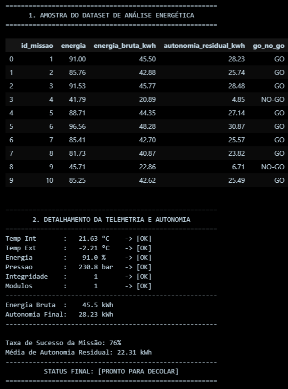

# Projeto Aurora Siger - Sistema de Monitoramento Pré-Decolagem 

Este projeto integra engenharia de sistemas aeroespaciais com ciência de dados. O **Aurora Siger** é um software de monitoramento que simula a telemetria crítica de uma aeronave, validando parâmetros de segurança e realizando cálculos de autonomia energética em tempo real para suporte à decisão de lançamento.

## Funcionalidades Principais
* **Análise Preditiva de Autonomia:** Cálculo de energia bruta (kWh) e autonomia inicial pós decolagem.
* **Processamento em Lote (Batch):** Simulação de 100 missões simultâneas para geração de estatísticas de confiabilidade.
* **Dataset** Exportação automática de um dataset completo em formato `.csv`

---

## Parâmetros Técnicos e Escopo de Segurança

O sistema utiliza os seguintes *thresholds* baseados em normas internacionais para autorização de voo:

| Parâmetro | Unidade | Intervalo Seguro | Norma/Referência |
| :--- | :--- | :--- | :--- |
| **Temp. Interna** | °C | 21.0 - 25.0 | ASHRAE Standard 55 |
| **Temp. Externa** | °C | -10.0 - 38.0 | NASA GEVS |
| **Pressão Tanques** | bar | 200 - 300 | Sutton (Rocket Prop.) |
| **Nível de Energia**| % | ≥ 80.0 | Premissa Operacional |
| **Sistemas Críticos**| bin | 1 (Nominal) | Requisito de Missão |

###  Equações de Engenharia Elétrica 
O software aplica as seguintes fórmulas para validar a viabilidade energética:
1.  **Energia Bruta (kWh):** $$Capacidade\ Total \times (Nivel\ Energia / 100)$$
2.  **Autonomia Residual:** $$(Energia\ Bruta \times Eficiência) - Consumo\ Estimado$$
    * *Critério de Segurança:* A decolagem só é autorizada se a Autonomia Residual for **> 10 kWh**.

---

##  Funcionamento do Algoritmo

1.  **Geração Estocástica**: O script simula 100 registros de telemetria com **78% de probabilidade de sucesso** (missões nominais) e 22% de anomalias críticas para testes de estresse.
2.  **Validação de Vetores**: Uma função de checklist verifica cada dado individualmente contra os limites de segurança (Critério de Falha Única).
3.  **Processamento de Dataset**: O sistema compila os resultados em uma tabela, calculando a taxa de sucesso global e a média de autonomia da frota simulada.
4.  **Veredito de Missão**: O status final é gerado com foco na missão atual, exibindo o diagnóstico detalhado de todos os sensores e o balanço energético.

---

##  Tecnologias e Bibliotecas
* **Python 3.x**: Núcleo lógico e estrutural.
* **Pandas**: Estruturação de dados em DataFrames e manipulação de arquivos CSV.
* **NumPy**: Suporte para operações matemáticas e cálculos vetoriais.
* **Jupyter/Python Notebook**: Ambiente de desenvolvimento e exibição de tabelas.

---

## Instruções de Execução
1. **Pré-requisitos**: Certifique-se de ter o Python instalado e uma interface que suporte arquivos.ipynb, recomenda-se o VS Code com a extensão "Jupyter" ou o Jupyter Lab. Você pode verificar a versão do seu Python digitando o seguinte comando no terminal:
```bash
python --version
```
2. **Clonagem ou Download**: Faça o download dos arquivos do projeto ou clone o repositório em uma pasta de sua preferência.
3. **Instalação de Dependências**: O projeto utiliza as bibliotecas Pandas e NumPy para o processamento de dados e cálculos vetoriais. Para instalá-las, abra o terminal (ou CMD) dentro da pasta do projeto e execute:
```bash
pip install pandas numpy ipykernel
```
Nota: O ipykernel é necessário para que o VS Code consiga conectar o Python ao Notebook.
4. **Abertura do projeto**: Abra a pasta do projeto no VS Code, clique no arquivo Aurora_Siger.ipynb e, no canto superior direito, clique em "Select Kernel" e escolha a sua instalação do Python.
5. **Execução do Script**: Com as dependências instaladas, clique no botão "Run All" (Executar Tudo) no topo do arquivo.
6.  **Resultados e saídas**: 
* As tabelas (amostra do dataset) e o relatório de telemetria aparecerão logo abaixo das células de código.
* Após a execução da última célula, o arquivo telemetria_aurora.csv será gerado/atualizado automaticamente na mesma pasta do projeto.

##  Exemplo de Relatório de Saída

